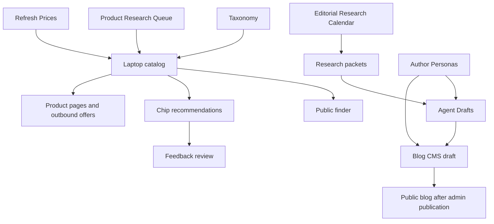
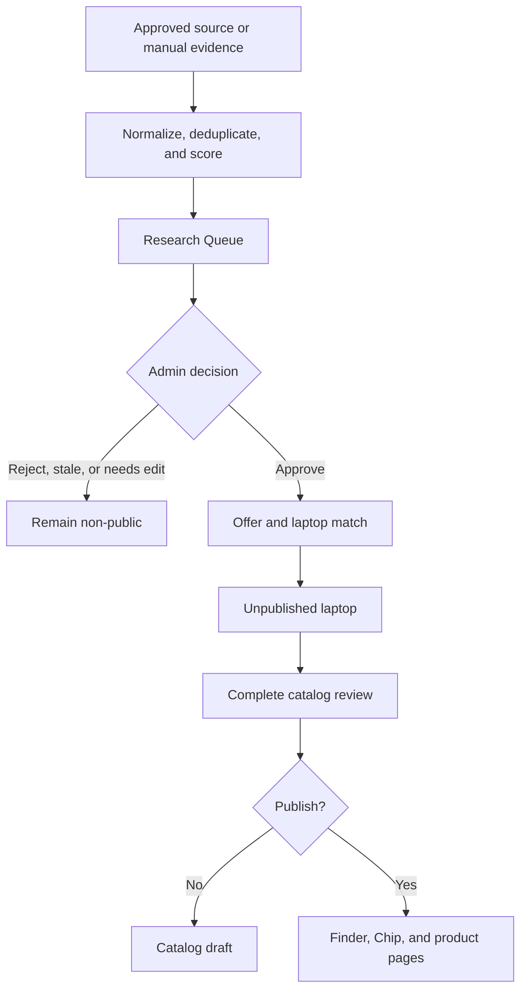
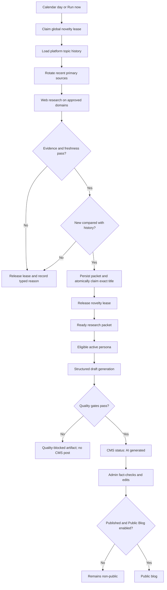
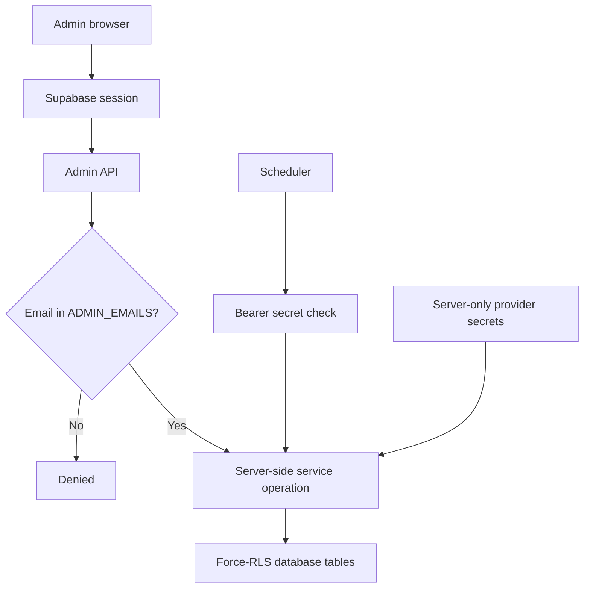
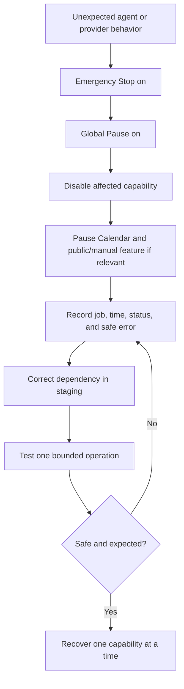

# LaptopFinder Admin Operations Guide

Version: **2026.08**

Audience: platform operators, power users, and technical owners

In-app guide: **Admin → Admin Guide** (`/admin/guide`)

This handbook explains how to operate LaptopFinder safely, how the admin features depend on one another, and how to make informed decisions when extending the platform. It is written for readers without a coding background first; technical notes are separated for power users.

> This guide describes the current implementation. It does not assume that every stored setting or future job type is already wired into an operational workflow.

## How to use this guide

- **Platform operator:** follow the numbered procedures and warnings. No coding knowledge is required.
- **Power user:** also read the dependency, current-boundary, and extension sections before proposing a product change.
- **Technical owner:** use the implementation paths, migration order, environment boundaries, and release checklist.

These are documentation roles, not application roles. LaptopFinder currently has one admin permission level: every signed-in email listed in `ADMIN_EMAILS` receives the same admin capabilities.

## Read this first

1. Work on the `preview` branch with the staging Supabase project.
2. Test at `dev.laptopfinder.cc` before considering production promotion.
3. Prefer draft, hidden, archived, paused, or unpublished states over deletion.
4. Treat AI extraction and generation as editable input—not verified evidence.
5. Keep Safe mode on during normal staging and editorial review.
6. Enable one automation capability at a time and test one small end-to-end run.
7. Never apply migrations to staging or production unless explicitly requested. Run forward migrations manually in order and retain every rollback.
8. Never promote to `master` or make a production database change without explicit approval.

## The four features most often confused

### Product Curation

- **Path:** Admin -> Growth Agents -> Product Curation
- **Route:** `/admin/growth-agents/curation`

**Purpose:** convert plain-English domain expectations into a versioned rulebook, audit the existing catalog first, and prepare only a small number of gap-filling decisions.

**How the path is linked**

```text
Taxonomy + admin rulebook
          |
          v
Existing catalog audit ---> course-mapping proposals ---> admin approve/reject
          |
          | only when a verified gap remains
          v
Bounded Amazon search ---> dedupe + hardware + API-budget gates
          |
          v
Research Queue candidate ---> admin approve ---> unpublished Laptop
                                                   |
                                                   v
                                         separate admin publication
```

**Procedure**

1. Leave **Paused** on while configuring the feature.
2. Choose Design, Technology, or Management and write the expected workloads, hardware, portability, value, longevity, exclusions, and valid gaps in plain English.
3. Keep domain and course recommendation caps small to prevent decision fatigue.
4. Save the prose, then select **Compile and enable**. Compilation validates a structured interpretation; it changes no catalog record.
5. Select **Audit existing catalog**. Review every proposed addition/removal of a course mapping.
6. Set conservative search, item, requests-per-second, daily-call, and refresh budgets.
7. Run **Refresh now**, then **Discover now** in staging.
8. Open Research Queue and inspect the target domain, portfolio role, gap reason, curation score, rulebook version, and suggested course mappings.
9. Enable Daily discovery and/or Catalog refresh, then clear Paused only after the manual test succeeds.

**Important behavior**

- The model interprets prose and proposes narrow searches. Deterministic code controls catalog reuse, specifications, deduplication, caps, cooldown, freshness, and API budgets.
- A search is not allowed when existing catalog laptops can fill the course gap, the domain cap is reached, or three decisions are already pending.
- Candidate approval creates an unpublished laptop. Course mappings shown on that candidate are part of that approval; existing-laptop mapping proposals have separate Approve/Reject buttons.
- Publication always remains a separate Laptops action.
- The current Vercel Hobby cron polls once daily around 03:00 Asia/Kolkata and can be delayed within the hour. Exact arbitrary times or a rolling 22-hour trigger require Pro or an approved external hourly scheduler.
- Amazon price/availability has an exact freshness expiry; stale data is not presented as current.

**Common dependencies:** migration 034 after 024-033, active Taxonomy courses, Research Agent permission, validated/enabled Amazon source, OpenAI key/model for compilation, Supabase service role, and CRON_SECRET for scheduled calls.

### Research Queue

**Purpose:** product ingestion.

Manual JSON or an approved marketplace adapter becomes a normalized candidate. Admin approval can create or link an **unpublished laptop**. It does not create editorial research packets.

- **Path:** Admin → Growth Agents → Research Queue
- **Route:** `/admin/growth-agents/research`

### Research Calendar

**Purpose:** editorial web research.

A configured day and theme cause the Research Agent to search approved web domains. Before a topic can become a research packet, deterministic server checks compare it across the platform with recent research packets and non-archived CMS posts. It does not consume Product Research Queue candidates.

- **Path:** Admin → Growth Agents → Research Calendar
- **Route:** `/admin/growth-agents/calendar`

### Agent Drafts

**Purpose:** editorial writing handoff.

A ready, nonexpired research packet plus an eligible persona can become an `ai_generated` Blog CMS draft after quality checks. It never publishes the post.

- **Path:** Admin → Growth Agents → Agent Drafts
- **Route:** `/admin/growth-agents/blog`

## Platform structure



The product and editorial pipelines share authorization, configuration, jobs, and audits, but they do not automatically exchange evidence.

## Product catalog path



Approval in Research Queue is not publication. The final public gate is always the laptop's Publish state.

## Editorial path



No current agent path auto-publishes a Blog post.

## Shared security structure



The browser should not receive service-role or provider credentials. Catalog, CMS, settings, persona, and agent mutations are performed through authenticated server routes.

## First-time safe setup

1. Confirm the hostname is `dev.laptopfinder.cc` and the database is staging.
2. Sign in with an account included in `ADMIN_EMAILS`.
3. Confirm migrations 024–034 are available and have been applied manually in order where required.
4. Keep Research, Blogging, Chip Learning, and Affiliate capabilities off; keep Safe mode on; keep the Calendar paused.
5. Configure **Settings** conservatively: disclaimer, contact link, and only ready public domains.
6. Build **Taxonomy** before tagging laptops.
7. Add a small verified set of **Laptops** as drafts.
8. Publish enough verified laptops to give the intended domain useful coverage.
9. Enable that domain only after its taxonomy and catalog are ready.
10. Enable Blog CMS while keeping Public Blog off during setup.
11. Create, disclose, preview, and activate at least one **Author Persona**.
12. Review Growth Agent retention and provider/source state.
13. Test one manual **Research Queue** import and promotion.
14. Enable Research Agent and test one enabled Calendar day with **Run now**.
15. Enable Blogging Agent and generate one **Agent Draft** manually.
16. Review the resulting post in **Blog** and publish only after fact-checking.
17. Test price refresh and safe outbound behavior in staging.
18. Test the authenticated cron.
19. Only then configure nonzero automatic draft caps and an auto-scheduled persona.
20. Affiliate monetization should be the last capability enabled.

## Routine operations

### Every admin session

- Review Dashboard publication counts and recent changes.
- Check Growth Agents for failed or repeatedly retrying jobs.
- Review urgent price/availability attention before publishing new work.

### Daily when agents are enabled

- Review recent Research Calendar runs.
- Read the displayed no-topic reason when a run creates no packet; duplicate, freshness, evidence, source-rotation, and source-configuration outcomes are operational information rather than provider failures.
- Inspect new research packets and Agent Draft artifacts.
- Leave uncertain results in review, draft, stale, or quality-blocked states.

### Weekly

- Review Dashboard coverage gaps.
- Review negative Chip feedback for patterns.
- Refresh prices in planned, bounded batches.
- Plan next week's research themes, sources, audiences, and caps.
- Review the public Blog queue and stale drafts.

### Monthly

- Audit active personas and source permissions.
- Review retention periods and repeated job failures.
- Confirm domain and Blog flags still match the available public content.
- Verify provider credentials and cron behavior in staging.

## Current operational boundaries

These are important because similarly named controls do not all cover the same operations.

### Stop-control scope

Global Pause and Emergency Stop gate:

- Research Calendar execution
- Blog Agent generation
- Affiliate monetization

They do **not** currently disable:

- Product Research Queue ingestion or review
- Public Chip chat
- Chip learning unless its own capability is turned off
- Manual Blog AI Assist
- Add Laptop AI/Amazon extraction
- Refresh Prices

For a broad incident, turn on both stop controls, turn off each affected capability, pause the Calendar, and disable any related public/manual feature separately.

### Calendar manual versus scheduled gates

- **Run now** ignores the Calendar's Enabled/Paused state.
- Run now still requires the selected day enabled, Research Agent enabled, Emergency Stop off, and Global Pause off.
- Scheduled runs additionally require the Calendar enabled and unpaused.
- The bundled cron polls once per day around 03:30 UTC / 09:00 IST. Stored day times are not precise with a once-daily poll.

### Research awareness is supplied by the server

Every Research Agent call is stateless. It does not remember an earlier call, and the novelty workflow does not use embeddings or hidden model memory. Before each call, the server loads the configured platform history and supplies recent covered topics as context. After generation, the server independently applies that history as a deterministic acceptance gate.

The default policy compares candidates with non-rejected research packets and non-archived CMS posts from the previous 180 days. Rejected packets are deliberately remembered for only 30 days, even when the configured history window is wider. An administrator can set the main window from 90 to 365 days and the similarity cutoff from 20% to 95%; the default cutoff is 62%. Lowering the cutoff rejects more related angles.

The percentage controls the weighted semantic comparison. Hard duplicate anchors can reject independently of that percentage: the same readable normalized-title fingerprint, the same rich subject key, or the same canonical source URL with matching domain, subject/product, and intent. The title fingerprint is normalized title text. The subject key is a separate hash assembled from normalized source-domain, subject/product, intent, audience, content-type, and title-token features.

The server will compare at most 500 eligible history items across packets and posts. If more than 500 qualify, it stops the run before web research rather than silently forgetting older coverage. Shorten the history window, archive obsolete CMS posts, or ask a technical owner to review retention and volume before retrying.

A platform-wide novelty lease allows one Research Calendar run at a time to perform the history load, candidate selection, and packet persistence. A busy run retries instead of selecting against stale parallel history. Persistence also claims the exact-title fingerprint atomically, and that claim remains reserved beyond the normal history window and packet status changes. The lease is released before optional Blog draft generation, so it does not serialize the editorial drafting stage.

When source rotation is enabled, the server checks the last two non-empty research runs for the same calendar day within the previous 14 days. A recently dominant primary domain is withheld from that run. If no approved domain remains, the run safely ends with a `source_rotation` explanation instead of broadening the search. Rotation is separate from topic novelty and never makes an unapproved domain available.

### Automatic draft gates

A scheduled research packet can create a Blog draft only when all of these are true:

- Blogging Agent is enabled.
- Daily, weekly, and automatic caps have remaining capacity.
- An active, topic-eligible persona has **Can be auto-scheduled** enabled.
- Research and draft quality thresholds pass.

Automatic caps begin at zero, and seeded personas begin with auto-scheduling off. This is intentional fail-closed setup.

### Calendar mode

The mode field currently records intent. It is not used to enable an auto-publication path. Leave it at **Draft only** unless the runtime behavior is deliberately extended and tested.

### API source activation

Turning on an API source performs a fresh server-side credential check before changing the queue state. A successful check saves `credential_status = valid`, the health timestamp, and an audit event, then enables the source. Missing or rejected credentials keep the source disabled and display a scrubbed explanation; secrets and provider response bodies never reach the browser.

**Probe health** in Research Queue runs and saves the same validation without enabling the source. This is useful when an operator wants to verify configuration first and then enable the source under **Growth Agents → Approved sources**. Amazon's probe authenticates the configured Creators API client and confirms that the partner tag is present; importing one Amazon candidate remains the end-to-end catalog-access test.

Source activation, public outbound-link permission, and the global **Affiliate links** capability are separate controls. Enabling Amazon for Product Research Queue ingestion does not automatically expose public affiliate links.

### Public outbound permission

Turning off a source's public-display permission prevents monetized/source-specific presentation and fresh offer details. The centralized outbound route may still return an allowlisted canonical, non-affiliate destination with a generic “Check current price” action.

### Advisory data

Feedback and affiliate clicks do not automatically retrain or rerank the platform. Chip learning stores privacy-minimized structured memory for the anonymous session. A person still decides whether catalog, taxonomy, prompt, or product behavior should change.

## Screen-by-screen instructions

### Dashboard

- **Path:** Admin → Dashboard
- **Route:** `/admin`

**Purpose:** read-only overview of catalog counts, publication state, course coverage, and recent laptop changes.

**Procedure**

1. Compare Total Laptops, Published, and Drafts.
2. Review coverage by domain and note courses with zero or few published recommendations.
3. Open recently changed laptops and confirm the changes were intended.
4. Choose Add Laptop for known evidence or Research Queue when evidence still needs normalization/review.

**Linked features**

- Taxonomy defines the coverage rows.
- Published laptops supply coverage counts.
- Dashboard does not show agent health; use Growth Agents and Research Calendar for that.

**Mobile note:** tier pills are hidden on narrow screens, but coverage counts remain visible.

<details>
<summary>Power-user notes</summary>

- Coverage uses exact stored course text and is scoped by domain.
- A hidden, deleted, or renamed taxonomy entry can disappear from coverage even if old laptop text tags remain.
- Primary implementation: `src/app/admin/page.tsx`.

</details>

### Laptops

- **Path:** Admin → Laptops
- **Routes:** `/admin/laptops`, `/admin/laptops/new`, `/admin/laptops/[id]`

**Purpose:** maintain the authoritative product catalog and make the final publication decision.

**Before starting**

- Ensure the correct taxonomy exists.
- Have reliable product evidence and a valid Amazon URL when creating a legacy laptop.
- Know which domain should own the laptop.

**Procedure**

1. Search before creating a record to avoid duplicates.
2. Choose the Domain first.
3. Use supported Amazon extraction, pasted evidence, or manual entry.
4. Verify name, exact model, CPU/GPU, RAM, storage, display, weight, OS, price, image, and URL.
5. Assign tier, workloads, programmes, recommendation reasoning, cautions, upgrades, and four-year suitability.
6. Set priority and optional homepage feature state.
7. Keep the record unpublished while any important fact is uncertain.
8. Save, inspect the presentation, then publish only when the recommendation is defensible and the domain is enabled.

**Important behavior**

- AI extraction pre-fills fields; it does not verify facts.
- Changing Domain does not clear old hidden workload/course values. Recheck every tag after a domain change.
- Publishing changes public eligibility immediately.
- Deletion is permanent; unpublish when retirement is sufficient.
- Publishing Technology/Management before its domain flag is enabled can lead users to a disabled destination.
- Under 640px, Price and Featured columns are hidden. Price remains editable through Edit Laptop; featuring currently requires a wider view.

**Linked features**

- Taxonomy supplies programme choices.
- Research Queue sends approved candidates here as unpublished records.
- Published laptops feed the finder, Chip, comparisons, Blog product blocks, homepage picks, and outbound offers.
- Refresh Prices updates Amazon-backed price and availability.

<details>
<summary>Troubleshooting and power-user notes</summary>

- Missing course: add/activate it in Taxonomy for the selected domain.
- Amazon extraction unavailable: verify account/credentials or use pasted facts.
- Public item missing: verify Published, domain flag, and active public filters.
- Catalog writes use `src/app/api/admin/laptops/route.ts` and `src/lib/admin/catalog-write.ts`.
- Slug and derived price labels are server-controlled.

</details>

### Taxonomy

- **Path:** Admin → Taxonomy
- **Route:** `/admin/taxonomy`

**Purpose:** maintain programmes and specialisations used by the public finder, laptop forms, and Dashboard coverage.

**Procedure**

1. Select Design, Technology, or Management.
2. Add a plain-language programme and optional specialisation.
3. Set sort order.
4. Keep it active when it should appear in new choices.
5. Prefer hiding over deleting.
6. After renaming or deleting, review affected laptop tags manually.

**Important behavior:** laptop course assignments are stored as text. Hiding, renaming, or deleting a taxonomy row does not rewrite existing laptop tags.

<details>
<summary>Power-user notes</summary>

- Workload tags and some domain wording remain code-managed.
- Primary paths: `src/components/admin/taxonomy/TaxonomyManager.tsx`, `src/app/api/admin/taxonomy/courses/route.ts`.

</details>

### Blog

- **Path:** Admin → Blog
- **Routes:** `/admin/blog`, `/admin/blog/new`, `/admin/blog/[id]`

**Purpose:** manual and AI-assisted editorial CMS.

**Prerequisites**

- Blog CMS enabled in Settings.
- Verified facts and sources.
- An appropriate active author persona for AI generation.

**Post statuses**

- `draft`: manual work in progress.
- `ai_generated`: contains generated output and requires review.
- `review`: editorial review stage.
- `published`: publicly eligible when public Blog is enabled.
- `archived`: not publicly eligible.

**Procedure**

1. Open a post or choose New post.
2. Set title, stable slug, excerpt, category, and author.
3. Add structured content blocks.
4. Use AI Assist only for supported generation and review all output.
5. Add safe internal CTAs and relevant product blocks.
6. Complete SEO fields.
7. Preview the rendered post and author disclosure.
8. Save as draft/review until every claim, source, CTA, and product selection is verified.
9. Publish manually.

**Important behavior**

- AI generation never publishes.
- CTA links are restricted to internal paths.
- Changing a published slug changes its URL; no redirect is automatically created.
- Public Blog, product blocks, structured data, and sitemap each have separate Settings flags.
- There is no Blog category-management screen today.

<details>
<summary>Power-user notes</summary>

- Structured blocks must remain backward compatible with the public renderer.
- Manual CMS actions are not limited by persona AI permissions.
- Primary paths: `src/components/admin/blog/BlogPostForm.tsx`, `src/lib/blog/schemas.ts`, `src/components/blog/BlockRenderer.tsx`.

</details>

### Author Personas

- **Path:** Admin → Author Personas
- **Routes:** `/admin/personas`, `/admin/personas/new`, `/admin/personas/[id]`, `/admin/personas/[id]/preview`

**Purpose:** transparent public authorship plus AI voice, topic fit, permissions, and affiliate policy.

**Procedure**

1. Set display name, stable slug, public role, author type, optional avatar, bio, and required disclosure.
2. Add expertise, audience, topic/category, and software tags.
3. Define buying philosophy, writing rules, system guidance, and tone levels.
4. Grant only needed AI permissions.
5. Set product-card limits and required affiliate disclosure.
6. Preview a writing sample.
7. Save the new version and activate only when ready.
8. Archive or soft-delete to stop future assignment while preserving attribution.
9. Hard-delete only an unused, non-fallback persona.

**Permission meaning**

- Can write blogs: eligible for AI Blog generation.
- Can write comparisons: additionally required for comparison generation.
- Can insert product cards: governs AI product-card generation.
- Can be auto-scheduled: required for automatic scheduled handoff.

These govern AI/agent paths. They do not remove an administrator's manual CMS capability. `Always requires manual review = false` does not create an auto-publication path.

**Important behavior**

- Each save creates an immutable version record.
- Posts store a persona snapshot, so later changes do not silently rewrite historical attribution.
- Used slugs cannot be changed.
- Seeded personas start with auto-scheduling off.

### Growth Agents

- **Path:** Admin → Growth Agents
- **Route:** `/admin/growth-agents`

**Purpose:** control autonomous capability flags, retention, source state, and recent durable jobs.

**Procedure**

1. Read the execution banner.
2. Keep Safe mode on for review-controlled operations.
3. Understand the exact stop-control scope described earlier.
4. Review retention periods before changing them. Shortening a period can cause irreversible cleanup; increasing it cannot restore deleted data.
5. Confirm the provider variables were added by the technical owner and the deployment was rebuilt after any change.
6. Turn on one API source. The server validates and saves credential health before enabling it; if validation fails, leave it off and follow the displayed message. Treat public outbound presentation/monetization as a separate permission.
7. Enable one capability and select **Save controls**.
8. Test that capability in staging.
9. Review recent jobs for repeated failure/retry patterns.

**Capabilities**

- Research Agent
- Blogging Agent
- Chip Learning
- Affiliate Links

**Retention records**

- Raw product payloads
- Chip interaction events
- Anonymous profiles
- Full chat transcripts
- Agent jobs
- Affiliate clicks
- Audit events

**Limitations**

- Recent Jobs is informational; there is no retry/cancel UI.
- Notifications, full audit records, and affiliate click details do not have dedicated admin dashboards.
- API-source first-time credential activation is a technical-owner boundary.
- The displayed source freshness TTL is stored configuration; candidate price freshness currently uses adapter-specific runtime windows (Amazon one hour, Flipkart/manual 24 hours).

### Research Queue

- **Path:** Admin → Growth Agents → Research Queue
- **Route:** `/admin/growth-agents/research`

**Purpose:** ingest, normalize, score, review, and promote product evidence.

**Procedure**

1. Review source health.
2. Choose Manual, Amazon, or another actually enabled adapter.
3. Provide a product identifier/URL or replace every value in the manual JSON example.
4. Select **Normalize and queue**.
5. Inspect the source, variant, normalized specifications, timestamps, price freshness, confidence, fit, risks, and compliance.
6. Choose Approve, Needs edit, Mark stale, or Reject; add a useful admin note.
7. After approval, open the linked unpublished Laptop.
8. Complete recommendation context and publish separately after final review.

**Approval requirements**

- Safe compliance.
- Confidence at least 50.
- Brand or model.
- CPU.
- RAM capacity.
- Storage capacity.
- Product URL.

**Important behavior**

- Needs edit is a status/note, not an inline candidate editor. Correct evidence and re-import.
- Missing fields remain unknown; normalization should not invent them.
- New legacy laptops require an Amazon URL. A non-Amazon/manual offer can only attach to an existing deduplicated laptop.
- The example `retailer.example` URL is illustrative and cannot promote a brand-new laptop.
- Queue work is independent of Research Agent, Global Pause, and Emergency Stop.

### Research Calendar

- **Path:** Admin → Growth Agents → Research Calendar
- **Route:** `/admin/growth-agents/calendar`

**Purpose:** plan recurring editorial web research by day, theme, audience, source group, quality threshold, novelty policy, and volume.

**Procedure**

1. Keep the Calendar paused while configuring it.
2. Use Draft only mode.
3. Set calendar name, IANA timezone, and daily/weekly caps.
4. Set the Topic history window. The default is 180 days; accepted values are 90–365 days. Rejected packets remain comparison history for only 30 days, regardless of a wider setting.
5. Keep the Topic similarity cutoff at the recommended 62% until staging results justify a policy change. Lower percentages reject more related topics; higher percentages allow more weighted overlap. Exact-title, exact-subject-key, and same-source/domain/subject/intent anchors can still reject independently of this percentage.
6. Leave Rotate recently used primary sources enabled unless the available source set is intentionally narrow. It considers the last two non-empty research runs for the same day within the previous 14 days.
7. Configure and enable one day: theme, description, keywords, audience, preferred persona slugs, approved source groups, target count, and thresholds.
8. Keep min ≤ target ≤ max, while noting that current runtime prompting uses target and enforces max; min is not a hard production guarantee.
9. Save schedule control, then save the day.
10. Use Run now and inspect the amber result notice, Recent runs, and Recent research packets. On a phone, these cards stack vertically; the status, typed reason badge, date, and full wrapped explanation remain readable without horizontal scrolling.
11. Improve sources or the angle when no qualifying topic is found. Read the displayed reason before changing a threshold, and do not lower quality merely to force output.
12. Enable and unpause the Calendar only after the manual test succeeds.
13. Configure automatic caps and an auto-scheduled persona only after manual drafting succeeds.

**How deterministic topic novelty works**

1. The server claims one platform-wide novelty lease. This serializes the history-to-selection-to-persistence section of Research Calendar runs so parallel workers do not make decisions from the same stale snapshot.
2. It reads platform-wide history from non-rejected research packets and non-archived Blog CMS posts in the configured window. Rejected packets use a separate fixed 30-day window. History is not limited to the selected weekday or persona.
3. If more than 500 packets and posts are eligible in total, the run fails closed before web research. It never silently truncates history to manufacture novelty.
4. The eligible history is supplied to the stateless Research Agent as already-covered context. The model itself has no memory of earlier runs.
5. After web research, the server applies its own weighted semantic feature comparison across title, angle, subject/product, intent, audience, content type, and source overlap. This is deterministic application logic, not an embedding search. The configured percentage is the boundary for this weighted comparison when a strong topic anchor is present.
6. Separate hard anchors do not depend on the percentage: an exact readable normalized-title fingerprint; an exact rich subject key; or the same canonical source URL with matching domain, subject/product, and intent. The title fingerprint is normalized title text. The subject key is a separate hash built from source-domain, subject/product, intent, audience, content-type, and title-token features.
7. Accepted packets make an atomic database claim on the exact-title fingerprint, then the server releases the novelty lease before optional Blog draft generation. Concurrent workers therefore cannot both persist the same normalized title.

The main history window defaults to 180 days and the admin range is 90–365 days; rejected packets are still limited to their fixed 30-day window. The default weighted similarity cutoff is 62%. The atomic exact-title claim remains reserved after the ordinary history window and after packet status changes; use a materially accurate new title only when the editorial decision or angle is genuinely different.

**Supported editorial source-priority groups**

- `approved-web`
- `official-platform`
- `official-manufacturer`
- `official-software`
- `official-documentation`
- `official-brand`
- `official-warranty`

Marketplace/internal keys alone intentionally produce no web packet. Marketplace product/price evidence belongs in Research Queue adapters.

**Status guidance**

- `succeeded`: requested safe work persisted.
- `partial`: research persisted, but one or more Blog handoffs failed.
- `no_good_topic`: no candidate passed every evidence, freshness, novelty, and source-policy gate; often a safe outcome rather than a system failure.
- `needs_admin_review` packet: below threshold. There is no packet approval UI today; revise inputs/threshold responsibly and rerun.

Recent runs show one of these typed explanations where applicable:

- `duplicate_topic`: an exact or sufficiently similar topic exists in platform history, or an exact-title database claim lost a concurrent race.
- `insufficient_freshness`: the candidate lacked current enough evidence for its time-sensitive claims.
- `insufficient_evidence`: verified citations or confidence did not meet the research policy.
- `source_rotation`: the same primary domain was recently dominant for this calendar day and rotation left no alternative domain for this run.
- `source_configuration`: the day did not resolve to an approved research source.
- `no_qualifying_candidate`: no candidate passed, or several different rejection causes applied and no single cause described the whole run.

These reason codes explain an expected zero-packet result. A provider, schema, authorization, or database fault remains a failed run instead.

If a failed run says the safe 500-item novelty-history limit was exceeded, do not keep retrying unchanged. Shorten the configured history window, archive genuinely obsolete CMS posts, or ask a technical owner to review data volume and retention. The limit exists so the platform never labels a topic novel after silently dropping eligible history.

<details>
<summary>Power-user limitation</summary>

Content types, carry-forward behavior, packet expiry, product-card limits, and affiliate-insertion mode exist in the data model but are not editable on the current Calendar screen. Topic history, similarity cutoff, and source rotation are calendar-wide controls and are editable under **Schedule control**. Adding other controls requires UI, validation, runtime-behavior, and test review—not documentation alone.

</details>

### Agent Drafts

- **Path:** Admin → Growth Agents → Agent Drafts
- **Route:** `/admin/growth-agents/blog`

**Purpose:** generate a quality-gated Blog draft from a ready research packet.

**Procedure**

1. Review a packet's topic, angle, confidence, urgency, and source count.
2. Auto-select or explicitly choose an active eligible persona.
3. Generate once and wait for the artifact status.
4. Read quality score, fact checks, source references, suggestions, and any blocked/failure reason.
5. Open a passing draft in Blog.
6. Recheck every source, fact, time-sensitive statement, CTA, and attribution.
7. Edit and publish only through Blog.

**Quality expectations**

- Evidence confidence meets the day threshold.
- At least one verified source.
- Valid structured blocks.
- Sufficient H2 structure, FAQ, and CTA.
- Required persona disclosure.
- No unsupported exact price.
- Overall quality threshold passes.

A passing result creates an unpublished `ai_generated` CMS post. A failed quality gate creates an artifact but no post. There is currently no retry button for a quality-blocked artifact; improve the research/content and run a valid new path.

### Feedback

- **Path:** Admin → Feedback
- **Route:** `/admin/feedback`

**Purpose:** read recent Chip conversations, ratings, comments, recommended slugs, and transcripts to identify quality issues.

**Procedure**

1. Review total, positive, and negative counts for the loaded recent set.
2. Open a negative or representative session.
3. On mobile, use Back to return from the transcript to the list.
4. Classify the issue: taxonomy, laptop fact, coverage, stale availability, prompt/response, or an out-of-scope request.
5. Correct the owning feature through its normal reviewed workflow.
6. Treat transcripts as user data and do not copy personal content into prompts or external tools without a valid reason.

This screen is read-only and loads up to 200 recent transcript-bearing sessions. Feedback does not automatically create a learning or ranking change. Default full-transcript retention is 90 days unless configured otherwise.

### Refresh Prices

- **Path:** Admin → Refresh Prices
- **Route:** `/admin/refresh-prices`

**Purpose:** update Amazon price/availability snapshots and remove unavailable products from normal public recommendations.

**Procedure**

1. Review the attention list of auto-unpublished products.
2. Prefer one laptop or the current page for investigation.
3. Use All Published only for a planned maintenance run.
4. Wait for the paced operation; do not start overlapping refreshes.
5. Review updated/failed counts, price, availability, and last-checked timestamps.
6. Investigate each failed ASIN/link separately.
7. Use Refresh All Unpublished only when you accept its opt-in back-in-stock republish behavior.
8. Verify a product before manually publishing it.

**Important behavior**

- Published products reported unavailable may be automatically unpublished.
- Individual recheck does not auto-republish.
- Refresh All Unpublished can auto-republish products reported available.
- Manual Publish can override a displayed unavailable state; verify first.
- Price refresh is independent of Growth Agent source toggles and stop switches.

### Settings

- **Path:** Admin → Settings
- **Route:** `/admin/settings`

There are three independently saved sections.

#### General

- WhatsApp destination shown publicly.
- Footer disclaimer.
- Chip voice input, using the routed transcription model (`LLM_MODEL_TRANSCRIPTION`, default `gpt-4o-mini-transcribe`).
- Guided Finder workload filter.

#### Domains

- Design remains live.
- Technology and Management flags expose their public tab/route.
- Prepare active taxonomy and suitable published laptops before enabling a domain.

#### Blog and AI

- Blog CMS: master CMS/admin route capability.
- Public Blog: permits published posts to be publicly visible.
- AI Blog Writer: exposes manual AI-assist controls.
- Product Blocks: enables editor placeholders and public rendering.
- Structured Data: Article/Breadcrumb/FAQ JSON-LD.
- Sitemap Inclusion: adds eligible posts and author archives.

Save each section separately and verify its affected staging path on phone and desktop.

## Incident procedure



1. Turn on Emergency Stop and Global Pause, then select **Save controls**.
2. Turn off Research, Blogging, Chip Learning, and/or Affiliate capability according to scope; save again.
3. Pause and save the Research Calendar.
4. Disable AI Writer, Voice Input, Public Blog, or a domain if the incident involves it.
5. Avoid Add Laptop extraction and Refresh Prices if external provider calls must stop.
6. Record the affected job type, time, status, and scrubbed error—not credentials or raw provider payloads.
7. Correct the dependency in staging.
8. Keep Safe mode on and test one small operation.
9. Recover one capability at a time.

Stop controls prevent new work within their scope; they may not cancel work already running. A complete provider/perimeter shutdown requires a technical owner.

## Common dependency reference

### Scheduled research requires

- Emergency Stop off.
- Global Pause off.
- Research Agent on.
- Calendar enabled and unpaused.
- Day enabled.
- Authenticated cron.
- OpenAI research model and approved domains configured.

### Manual Run now requires

- Emergency Stop off.
- Global Pause off.
- Research Agent on.
- Selected day enabled.
- Calendar enabled/unpaused is not required.

### Automatic Blog draft requires

- Scheduled research requirements.
- Blogging Agent on.
- Normal and automatic capacity remaining.
- Active, eligible, auto-scheduled persona.
- Confidence and quality thresholds passing.

### Manual Agent Draft requires

- Blogging Agent on.
- Emergency Stop and Global Pause off.
- Ready, nonexpired packet.
- Eligible active persona.
- OpenAI writer configured.

### Public Blog post requires

- Blog CMS on.
- Public Blog on.
- Post status `published`.

### Monetized outbound link requires

- Affiliate capability on.
- Safe mode off.
- Emergency Stop and Global Pause off.
- Source enabled, public, credential-valid, and allowlisted.
- Safe active offer and published laptop.

### Chip learning requires

- Chip Learning on.
- Required migration/data tables.
- Emergency Stop and Global Pause do not currently gate it.

### Refresh Prices requires

- Amazon account/API access and credentials.
- Valid Amazon URL/ASIN.
- It is independent of Growth Agent source toggles.

### Retention cleanup requires

- Every explicit retention setting readable.
- Authenticated daily cron.
- Cleanup fails closed if retention configuration cannot be read.

## Power-user extension guide

### Decision path

1. Define the user, operational outcome, public effect, owner, and measurable success.
2. Map the admin UI, API, service, database, provider, flags, retention, retries, and rollback.
3. Preserve the human approval boundary; default new automation to off.
4. Implement on preview with staging and the installed Next.js 16 documentation.
5. Add validation, authorization, privacy, idempotency, retry, mobile, empty-state, and public-result tests.
6. Deploy to preview, apply migrations manually, configure secrets, smoke-test, and observe.
7. Request explicit approval before promotion to master/production.

### Adding a source

Review and implement all of:

- Official API access and policy.
- Adapter and registry entry.
- Server-only credentials and credential lifecycle.
- Health behavior and persisted validation.
- Normalization, unknown-field behavior, deduplication, scoring, and compliance.
- Host/redirect allowlists and affiliate disclosure.
- Source seed plus forward/rollback migration.
- Raw-payload retention.
- Unit and staging smoke tests.

### Adding a persona permission

- Types and strict validation.
- Admin form and plain-language description.
- Service-side enforcement at the actual generation point.
- Prompt behavior.
- Version snapshots and historical attribution.
- Audit coverage and tests.

### Adding an admin mutation

- Admin session plus `ADMIN_EMAILS` authorization.
- Strict, bounded request schema.
- Server-side service-role write.
- RLS/grant impact.
- Cache/revalidation and audit behavior.
- Unit and route tests.

### Adding a background agent

- Explicit capability flag and kill-switch decision.
- Durable job type and dispatcher support.
- Idempotency key.
- Lease/fencing and atomic persistence.
- Retry limits and terminal behavior.
- Output/automatic caps.
- Notification and admin visibility.
- Retention category.
- Forward and rollback migrations.

Only `research.calendar` is currently dispatched by the scheduler even though additional job-type constants exist. A constant is not an implemented agent.

### Adding a domain

A new domain is not a taxonomy-only change. Review routes, types, database constraints, Settings flags, taxonomy, laptop schema/form, finder, Chip, public navigation, coverage, SEO, and tests.

### Changing models

Deployment model routing currently uses:

- Research: `LLM_MODEL_RESEARCH`
- Blogging/persona preview: `LLM_MODEL_BLOGGING`
- Chip: `LLM_MODEL_CHIP`
- Extraction: `LLM_MODEL_EXTRACTION`
- Transcription: `LLM_MODEL_TRANSCRIPTION`

Test structured-output compatibility, web-tool requirements, quality, latency, cost, privacy (`store: false` where supported), and failure behavior in staging before changing a default.

### Increasing scheduler frequency

Review platform plan limits, authentication, duration, cost, catch-up behavior, idempotency, leases, and daily/weekly caps. Editing a stored Calendar time alone does not make a once-daily poll precise.

## Technical configuration boundaries

The admin UI intentionally does not expose provider secrets. A technical owner manages:

- `ADMIN_EMAILS`
- Supabase public and service-role configuration
- `OPENAI_API_KEY`
- Task-specific model environment variables
- `RESEARCH_ALLOWED_DOMAINS`
- Amazon Creators API credentials and partner tag
- Flipkart credentials when current API access is confirmed
- `CRON_SECRET` and/or `AGENT_CRON_SECRET`
- Deployment WAF/rate limits

See `.env.example` and `docs/AUTONOMOUS_AGENTS_RUNBOOK.md` for the current environment and staging activation checklist.

## Migration and rollback order

Forward, in this exact order:

1. `024_create_agent_foundations.sql`
2. `025_create_product_research.sql`
3. `026_create_research_calendar.sql`
4. `027_add_blog_personas.sql`
5. `028_create_chip_learning.sql`
6. `029_create_blog_agent_metadata.sql`
7. `030_create_affiliate_click_events.sql`
8. `031_harden_chat_and_blog_access.sql`
9. `032_harden_catalog_and_taxonomy_access.sql`
10. `033_add_research_novelty.sql`
11. `034_add_product_curation.sql`

Rollback in exact reverse order:

1. `034_add_product_curation_rollback.sql`
2. `033_add_research_novelty_rollback.sql`
3. `032_harden_catalog_and_taxonomy_access_rollback.sql`
4. `031_harden_chat_and_blog_access_rollback.sql`
5. `030_create_affiliate_click_events_rollback.sql`
6. `029_create_blog_agent_metadata_rollback.sql`
7. `028_create_chip_learning_rollback.sql`
8. `027_add_blog_personas_rollback.sql`
9. `026_create_research_calendar_rollback.sql`
10. `025_create_product_research_rollback.sql`
11. `024_create_agent_foundations_rollback.sql`

The database operator runs these files manually; application deployment does not run them. For migration 033, first deploy compatible preview code with the Research Agent disabled, confirm migration 032 is already present, and then run `033_add_research_novelty.sql` against staging. Migration 033 adds the calendar policy fields, novelty audit metadata, typed no-topic reasons, exact-title claims, and the global novelty lease used to serialize history through packet persistence. Migration 034 then adds disabled product-curation rulebooks, schedules, review proposals, API budgets, and candidate metadata.

To reverse it, first stop research and deploy code that no longer reads migration-033 fields or calls its functions. Then run `033_add_research_novelty_rollback.sql` before rollback 032 or any earlier rollback. The rollback removes novelty policy/metadata and restores the original migration-026 persistence and completion functions. Do not apply or roll back a migration merely because this guide is being read or updated, and never apply it to production without explicit approval.

## Glossary

**Candidate:** Imported product evidence waiting for administrator review.

**Unpublished laptop:** A catalog record visible to admins but not eligible for normal public recommendation.

**Research packet:** A citation-bound editorial topic and evidence bundle.

**Topic history window:** The calendar-wide 90–365 day period used for non-rejected research packets and non-archived CMS posts. The default is 180 days. Rejected packets have a separate fixed 30-day comparison window.

**Topic similarity cutoff:** The server-side weighted semantic comparison boundary. The default is 62%; lower values reject more overlap. Exact-title, exact-subject-key, and same-source/domain/subject/intent anchors can reject independently of it. It does not use embeddings or model memory.

**Exact-title fingerprint:** Readable normalized title text used for exact matching and the permanent atomic database claim.

**Subject key:** A separate rich hash derived from normalized topic features such as source domain, subject/product, intent, audience, content type, and title tokens. It is not the readable title fingerprint.

**Novelty lease:** A platform-wide database lease that lets one Research Calendar run at a time load history, select topics, and persist packets. It is released before optional Blog drafting.

**Source rotation:** An optional pre-search guard that checks the last two non-empty research runs for the same calendar day within 14 days and temporarily withholds recently dominant primary domains. If that removes every approved domain, the run stops with a typed explanation.

**Agent artifact:** The durable record of a Blog generation attempt, quality result, and optional CMS draft.

**Persona snapshot:** The stored public author attribution version attached to a post.

**Safe mode:** The normal guardrail used during review-controlled operation. Its current material runtime gate is affiliate monetization; generated content is already draft-only.

**Global Pause:** A saved control that stops new Calendar research, Blog Agent work, and affiliate monetization within the implemented scope.

**Emergency Stop:** The immediate saved containment control for the same implemented agent scope. Use capability-specific switches for a broader incident.

**Source adapter:** A bounded manual or official-API integration that supplies product evidence.

**Durable job:** A retry-aware operational record with status, attempt count, lease, and scrubbed error fields.

## Keeping this guide current

When an admin route, setting, feature flag, agent gate, schema, scheduler, or publication behavior changes:

1. Update `src/lib/admin-guide/content.ts` for the in-app guide.
2. Update this handbook in the same commit.
3. Recheck every linked workflow and operational boundary.
4. Test the in-app guide at 320, 375, 430, 768, 1024, and 1440 pixels.
5. Test keyboard navigation, dark mode, 200% zoom, reduced motion, long paths, and empty search results.
6. Update the guide version only after the audit is complete.
