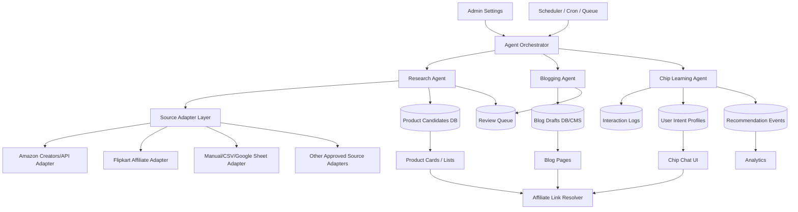

# System Architecture

## Core design

Use a modular agent architecture. Each agent should be a service layer with isolated responsibilities, shared event logging, shared admin controls, and shared source adapters.

## Main components

### 1. Agent Orchestrator

- Runs scheduled jobs.
- Checks feature flags and admin settings.
- Dispatches agent tasks.
- Enforces rate limits and review modes.
- Writes job logs.

### 2. Source Adapter Layer

Every marketplace/source should implement a common interface:

- `searchProducts(query, filters)`
- `getProductById(sourceProductId)`
- `normalizeProduct(rawProduct)`
- `generateAffiliateUrl(product, context)`
- `validateFreshness(product)`
- `getComplianceNotes()`

### 3. Product Candidate Store

Stores normalized product candidates before they become public products.

### 4. Review Queue

Admin-facing queue for:

- Product candidates
- Blog drafts
- Product-card suggestions
- Auto-generated comparison lists
- Monetized placements

### 5. Interaction Learning Store

Stores user interaction signals:

- User question type
- Budget range
- Course/program intent
- Software mentioned
- Clicked product/link
- Rejected recommendation
- Follow-up questions
- Confidence feedback

### 6. Affiliate Link Resolver

Central service that creates and logs affiliate links. Do not scatter affiliate logic across components.

### 7. Admin Settings

Admin must control:

- Agent enabled/disabled state
- Source enabled/disabled state
- Auto-draft vs auto-publish
- Review requirements
- Confidence thresholds
- Blog schedule slots
- Affiliate tag per source
- Ads enabled/disabled
- Safe fallback CTAs

## Recommended MVP architecture

Start with server-side services and database tables. Avoid complex multi-agent infrastructure until the basic loop is stable.

MVP can be:

- A scheduled server job or cron route.
- A source adapter registry.
- A review queue.
- Admin settings.
- Product candidate database.
- Blog draft generator.
- Chip interaction memory.

Avoid overengineering with external agent frameworks unless the current codebase already uses one.
