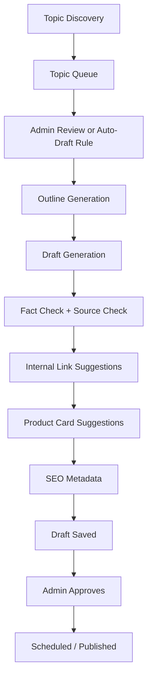

# Blogging Agent — Hot Topics, Writing, and Scheduling

## Purpose

The Blogging Agent should grow LaptopFinder through useful content, not generic SEO spam. It should find topics users actually care about, draft helpful articles, and schedule them through safe admin-controlled workflows.

## Topic discovery sources

Investigate available lawful/current sources before implementation:

- Internal search/chat queries from LaptopFinder
- Chip interaction logs
- Google Search Console if connected
- Google Analytics if connected
- Manual admin topic seed list
- Public trend/news/search tools only if approved and available
- Seasonal academic/admission calendar
- Marketplace/source insights from product candidate data
- Common student/parent questions

## Topic types

- Course-based laptop guides
- Budget strategy guides
- Brand comparison guides
- CPU/GPU explainers
- Amazon/Flipkart trust and buying-safety posts
- RAM/SSD upgrade guides
- Software requirement guides
- Deal-season checklists
- Parent-friendly guides
- “Do not overbuy” educational posts
- Misleading spec warning posts

## Blog workflow

## Draft quality rules

Every generated blog should include:

- Clear user problem.
- Practical buying advice.
- Mid-path recommendation, not extreme overspending.
- Context for Indian students/parents where relevant.
- Explanation of specs in simple language.
- Disclaimers for affiliate links.
- “Check current price” CTA when price freshness is uncertain.
- Internal links to existing LaptopFinder pages.
- Product cards only when contextually useful.

## Avoid

- Thin SEO pages.
- Fake urgency.
- Claiming exact current prices without fresh compliant data.
- Automatically publishing without admin policy.
- Recommending only high-commission products.
- Overloading articles with affiliate links.
- Making medical/legal/financial-like guarantees about laptop investment.

## Suggested first 10 blog topics

1. How to choose a laptop for CSE students without overspending.
2. RTX 3050 vs RTX 4050: sensible budget strategy for students.
3. Why RAM and SSD upgradeability matter more than chasing the highest GPU.
4. Amazon vs offline laptop buying: how to verify specs after delivery.
5. Best laptop specs for design students in 2026.
6. What parents should check before buying a laptop for college.
7. Laptop brand vs internal specs: what really matters.
8. Gaming laptop for design students: useful or overkill?
9. How much RAM do Adobe, Figma, Blender, and coding students need?
10. How Chip recommends laptops on LaptopFinder.

## Scheduling controls

Admin settings should include:

- Blogging Agent enabled/disabled
- Topic discovery frequency
- Draft generation frequency
- Auto-schedule enabled/disabled
- Default publishing slots
- Required approval count
- Maximum posts per week
- Minimum quality score
- Product-card insertion allowed/blocked
- Affiliate links allowed/blocked per post type

## Acceptance criteria

- Topics can be generated and stored without publishing.
- Drafts are visible for review.
- Blog generator uses internal product/context data where available.
- Fact-check checklist is stored with each draft.
- Scheduling respects admin settings.
- Existing blog system, if any, remains intact.

## Persona-based authoring

The Blogging Agent should delegate article voice and expert viewpoint to the Persona-Based Blog Author Agent when persona mode is enabled.

Updated workflow:

1. Research Agent collects trends, news, product candidates, software updates, and user-query signals.
2. Blogging Agent creates topic, intent, outline, SEO target, and product-card opportunity.
3. Persona Selector chooses the most suitable active persona.
4. Persona-Based Blog Author Agent writes the draft in that persona's voice.
5. Draft is saved with `authorPersonaId`, `authorType`, `personaVersion`, and `personaSelectionReason`.
6. Admin can approve, change persona, regenerate, schedule, or publish.
7. Published blog page displays the selected persona as the author.

Persona mode must support:

- Auto-select persona based on topic.
- Manual admin override.
- Regenerate same outline with another persona.
- Author card display on public blog page.
- Public author archive page where supported.
- Transparent disclosure for AI/editorial personas.

Persona-written posts must not use generic brand voice unless the selected persona is the LaptopFinder Editorial Guide.

## Input from Research Calendar

The Blogging Agent should consume approved or eligible `research_packet` records produced by the scheduled Research Agent. Each packet may include theme, target audience, suggested personas, content type, monetization intent, product candidates, confidence score, and expiry window.

Daily post targets are not absolute publishing commands. They are content production goals controlled by admin. If the packet quality is low, the Blogging Agent should not create filler content merely to hit a number.

The blog creation flow should respect:

- Day-wise theme
- Daily target post count
- Preferred persona author
- Source priority
- Approval mode
- Affiliate insertion mode
- Max product cards per post
- Minimum research confidence and blog quality score
