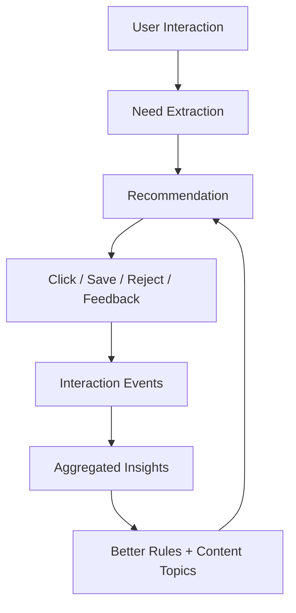

# Chip Agent — Learning, Trust, and Better Recommendations

## Purpose

Chip should become better over time by learning from user interactions while remaining transparent and helpful. The goal is not just to push laptops, but to help users understand what to buy and why.

## What Chip should learn

Chip can learn from:

- Budget ranges users mention.
- Courses/programs users select.
- Software needs users mention.
- Brand preferences and objections.
- Portability/battery/gaming/design requirements.
- Products clicked.
- Products rejected.
- Follow-up questions.
- Confusion points.
- Conversion signals if available.
- Blog topics that answer repeated questions.

## What Chip should not store by default

- Sensitive personal details.
- Exact unnecessary identity details.
- Private family details.
- Payment information.
- Any data not needed for recommendation improvement.

## Interaction event examples

```ts
type ChipInteractionEvent = {
  id: string;
  userId?: string;
  anonymousSessionId?: string;
  eventType: 'question' | 'answer' | 'product_click' | 'affiliate_click' | 'reject' | 'save' | 'feedback';
  intentTags: string[];
  budgetMin?: number;
  budgetMax?: number;
  courseTags?: string[];
  softwareTags?: string[];
  productId?: string;
  source?: string;
  confidence?: number;
  createdAt: string;
}
```

## Recommendation reasoning

Chip should explain recommendations using a simple structure:

1. **Why this fits you**
2. **What to check before buying**
3. **Where this may not be ideal**
4. **Upgrade path if relevant**
5. **Check current price / availability**

## Trust-building behaviors

Chip should:

- Be transparent about affiliate links.
- Explain that Amazon/Flipkart are purchase/delivery platforms and after-sales generally depends on brand service centers.
- Encourage users to verify specs after delivery using system information/BIOS where appropriate.
- Suggest buying from official brand stores or reliable sellers where possible.
- Avoid sounding like a salesperson.
- Tell users when a cheaper option is enough.
- Warn users when a popular model is not suitable.

## Suggested Chip tone

- Helpful
- Practical
- Calm
- Honest
- Not promotional
- Parent/student-friendly
- Confident but not overclaiming

## Chip response template

```text
Based on your requirement, I would shortlist this type of laptop first: [spec direction].

Why: [plain explanation].

A good option from the current list is [product], mainly because [reasons].

Before buying, check: [seller/store, RAM/SSD, warranty, exact GPU wattage if relevant, return policy].

I may earn through affiliate links, but the recommendation is based on fit first. You can also compare offline, but make sure the exact specs match.
```

## Learning loop



## Admin controls

Admin should control:

- Chip learning enabled/disabled
- Anonymous session memory duration
- Logged-in user memory duration
- Interaction event retention
- Whether affiliate links can appear in Chip responses
- Maximum product links per response
- Disclosure text
- Recommendation confidence threshold
- Human handoff / WhatsApp link option

## Acceptance criteria

- Chip can log interaction events.
- Chip recommendations can use approved product candidates.
- Chip can explain recommendations in a trust-building way.
- Affiliate CTAs are contextual and transparent.
- Learning does not break existing chat flow.
- Admin can turn learning and monetized links off.
