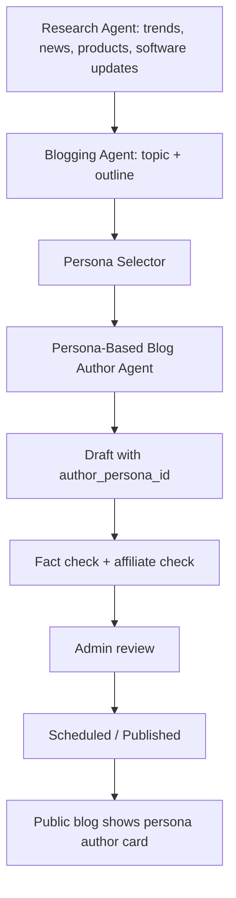

# Persona-Based Blog Author Agent

## Purpose

Add a separate Blog Author Persona Agent to LaptopFinder so blog articles are written from relevant expert viewpoints and displayed with clear author attribution.

This agent is not a replacement for the Blogging Agent. The Blogging Agent discovers topics, manages outlines, scheduling, SEO, and publishing. The Persona-Based Blog Author Agent receives research/news/product insights and writes the article in the selected author persona.

## Core requirement

Every persona-written blog must store and display the selected persona as the blog author.

Examples:

- Senior Design Professor / Fashion Design Software Mentor
- Experienced Native App Developer / Coding Laptop Specialist
- Parent-Friendly Laptop Buying Advisor
- Budget-Conscious Student Mentor
- AI/ML Workstation Advisor
- Video Editing and Animation Mentor
- Laptop Service and Reliability Expert

## Important trust rule

Do not create fake real-world humans. If a persona is not a real verified person, it must be presented as a LaptopFinder editorial/expert persona, not as a real professor, real coder, or real employee.

Allowed public framing:

- “Written by Prof. Mira, LaptopFinder Design Software Mentor”
- “Prof. Mira is a LaptopFinder editorial persona focused on design-student laptop guidance.”
- “Written by Dev Arjun, LaptopFinder Coding Laptop Specialist”

Avoid:

- Claiming the persona works at a real college or company unless verified and approved.
- Claiming real degrees, awards, employment, or personal experience for fictional personas.
- Pretending the persona personally tested a laptop unless a real test record exists.
- Hiding that a persona is an editorial persona.

## Workflow



## Persona selection logic

The agent should select persona using a weighted match:

- Topic category
- Software/workflow mentioned
- User segment: parent, student, design educator, CSE student, creator, developer
- Buying concern: budget, performance, trust, after-sales, upgrades, portability
- Research Agent input: trend/news/product/software-update context
- Admin persona priority and enable/disable status

Example mapping:

| Topic / signal | Preferred persona |
|---|---|
| Fashion design, CLO3D, Adobe, CorelDRAW, textile CAD, portfolio work | Senior Design Professor / Fashion Design Software Mentor |
| Android Studio, Xcode, React Native, Flutter, emulators, Docker | Native App Developer / Coding Laptop Specialist |
| First laptop for college, parent confusion, Amazon trust | Parent-Friendly Laptop Buying Advisor |
| RTX 3050 vs RTX 4050, RAM/SSD upgrade, budget | Budget-Conscious Student Mentor |
| Python, CUDA, local LLMs, ML coursework | AI/ML Workstation Advisor |
| Premiere Pro, After Effects, Blender, DaVinci Resolve | Video Editing and Animation Mentor |
| Service center, warranty, thermals, hinges, long-term reliability | Laptop Service and Reliability Expert |

If no persona confidently matches, use the default LaptopFinder Editorial Guide persona.

## Public author display requirement

Blog post pages must show:

- Author display name
- Persona title/role
- Avatar or icon, if configured
- Short bio
- Expertise tags
- Disclosure label when persona is AI/editorial
- Link to author/persona archive page

Example public author card:

> Written by Prof. Mira  
> LaptopFinder Design Software Mentor  
> An editorial persona focused on helping design students and parents understand software-led laptop requirements.

## Author archive pages

Each persona should have a public author page/route if the existing blog system supports it.

Suggested route:

`/blog/author/{persona_slug}`

Author page should show:

- Persona name and role
- Bio
- Disclosure
- Expertise tags
- All published posts by that persona
- Last updated date

## Draft metadata

Each persona-written draft must include:

```ts
type BlogDraftPersonaMetadata = {
  authorPersonaId: string;
  authorPersonaSlug: string;
  authorPersonaDisplayName: string;
  authorPersonaRole: string;
  authorType: 'human' | 'ai_persona' | 'brand';
  personaVersion: number;
  personaSelectionReason: string;
  researchInputIds: string[];
  factualClaimsChecklistId?: string;
  affiliateDisclosureIncluded: boolean;
}
```

## Persona writing behavior

The persona should shape:

- Opening style
- Examples used
- Depth of technical explanation
- Level of reassurance
- Buying philosophy
- CTA style
- Product-card placement

The persona must not change:

- Verified facts
- Product specs
- Affiliate disclosure
- Price freshness language
- Editorial honesty
- Safety and trust rules

## Persona examples

### Senior Design Professor / Fashion Design Software Mentor

Use for design education, fashion design, communication design, animation, UI/UX, portfolio, and software requirement posts.

Voice:

- Senior, calm, practical
- Explains in terms of student workflow
- Avoids jargon without dumbing down
- Warns against cosmetic laptop buying
- Emphasizes software, RAM, GPU, display, thermals, service, and upgradeability

Writing angle:

- “Think of the laptop as a studio tool, not a fashion accessory.”
- “Your choice should follow software workflow, not only brand preference.”

### Experienced Native App Developer / Coding Laptop Specialist

Use for coding, CSE, app development, emulators, IDEs, Docker, backend, and AI coding workflows.

Voice:

- Practical engineer
- Performance-conscious
- Explains bottlenecks clearly
- Discusses RAM, cores, SSD, thermals, ports, OS, virtualization
- Avoids unnecessary GPU hype unless relevant

Writing angle:

- “Your laptop should keep the development loop fast: code, build, run, test.”
- “A good coding laptop is not always the most expensive gaming laptop.”

## Admin override

Admin must be able to override the selected persona before draft generation and before publishing.

Admin must also be able to regenerate the same topic using another persona for comparison.

## Acceptance criteria

- A blog draft cannot be marked persona-written unless it has a valid `authorPersonaId`.
- Published persona-written posts display the persona author publicly.
- Admin can select/change persona before publishing.
- If a persona is archived later, old posts keep attribution using a snapshot/version.
- The platform does not make fictional personas look like verified real humans.
- Generated content varies meaningfully by persona while preserving factual accuracy.
