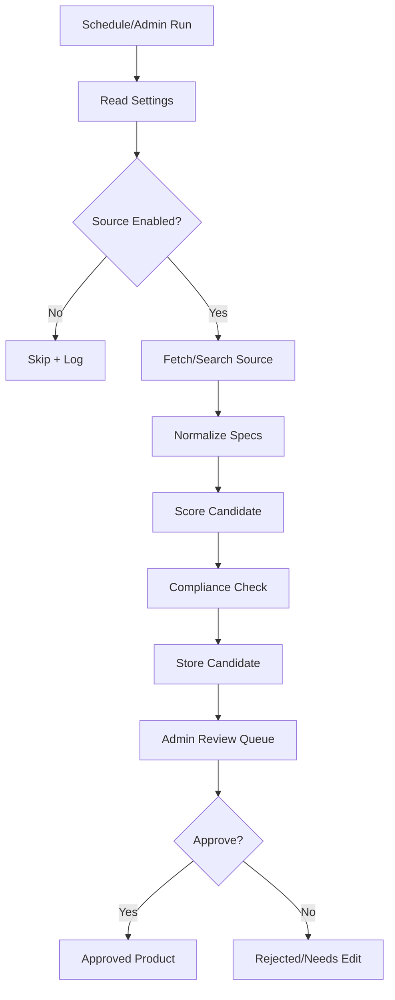
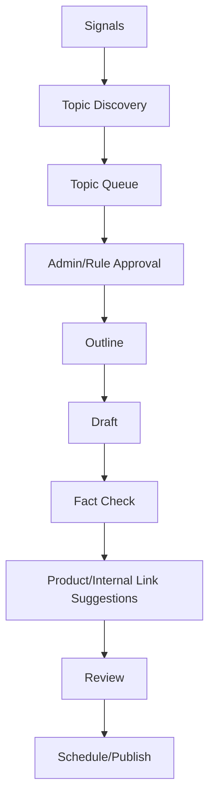
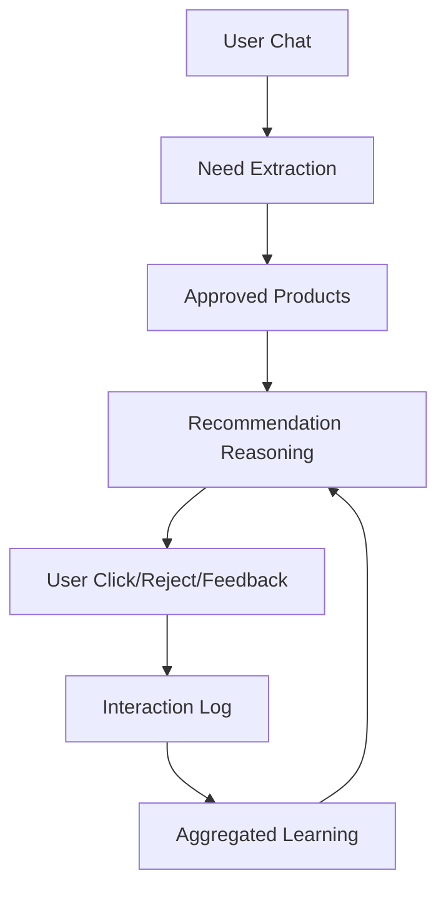
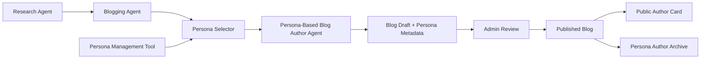

# Agent Flow Diagrams

## Research Agent

```mermaid
flowchart TD
  A[Schedule/Admin Run] --> B[Read Settings]
  B --> C{Source Enabled?}
  C -- No --> Z[Skip + Log]
  C -- Yes --> D[Fetch/Search Source]
  D --> E[Normalize Specs]
  E --> F[Score Candidate]
  F --> G[Compliance Check]
  G --> H[Store Candidate]
  H --> I[Admin Review Queue]
  I --> J{Approve?}
  J -- Yes --> K[Approved Product]
  J -- No --> L[Rejected/Needs Edit]
```

## Blogging Agent

```mermaid
flowchart TD
  A[Signals] --> B[Topic Discovery]
  B --> C[Topic Queue]
  C --> D[Admin/Rule Approval]
  D --> E[Outline]
  E --> F[Draft]
  F --> G[Fact Check]
  G --> H[Product/Internal Link Suggestions]
  H --> I[Review]
  I --> J[Schedule/Publish]
```

## Chip Learning

```mermaid
flowchart TD
  A[User Chat] --> B[Need Extraction]
  B --> C[Approved Products]
  C --> D[Recommendation Reasoning]
  D --> E[User Click/Reject/Feedback]
  E --> F[Interaction Log]
  F --> G[Aggregated Learning]
  G --> D
```

## Persona author workflow

```mermaid
flowchart LR
  R[Research Agent] --> B[Blogging Agent]
  B --> S[Persona Selector]
  PM[Persona Management Tool] --> S
  S --> P[Persona-Based Blog Author Agent]
  P --> D[Blog Draft + Persona Metadata]
  D --> A[Admin Review]
  A --> Pub[Published Blog]
  Pub --> Card[Public Author Card]
  Pub --> Archive[Persona Author Archive]
```
